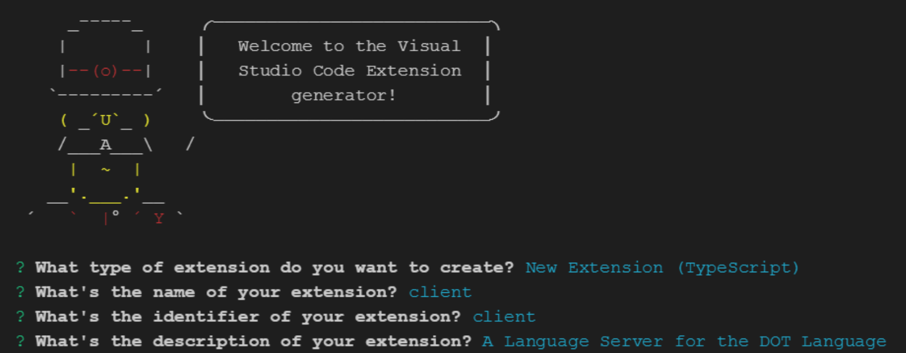
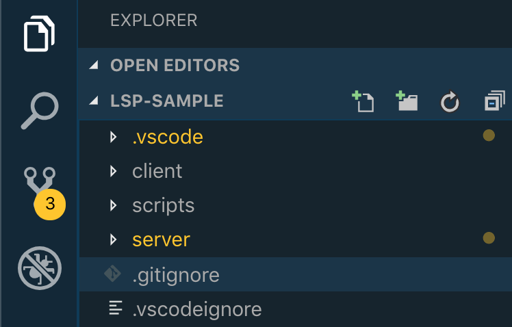
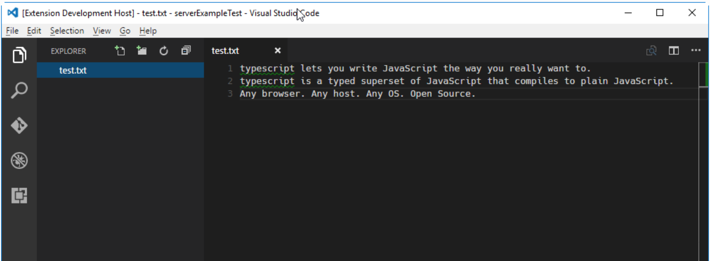

# LSP Example

Heavily documented sample code for https://code.visualstudio.com/api/language-extensions/language-server-extension-guide

See [language-server-dot-visual-studio](https://tomassetti.me/language-server-dot-visual-studio/) for a more complete example

## Create LSP project

To create an LSP project from scratch, use the Yo code generator:

```bash
$ npm install -g yo generator-code
$ yo code
```



## Functionality

This Language Server works for plain text file. It has the following language features:

- Completions
- Diagnostics regenerated on each file change or configuration change

It also includes an End-to-End test.

## Structure

The LSP is maintained in the `lsp` folder in the project root.

```
.
├── client // Language Client
│   ├── src
│   │   ├── test // End to End tests for Language Client / Server
│   │   └── extension.ts // Language Client entry point
├── package.json // The extension manifest.
└── server // Language Server
    └── src
        └── server.ts // Language Server entry point
```

## Running the Sample

- Run `npm install` in the `lsp` folder. This installs all necessary npm modules in both the client and server folder

- Open VS Code on this folder.

### Build project

- Press Ctrl+Shift+B to compile the client and server.
- Alternatively: Cmd+P (or Ctrl+P on Windows/Linux), then `> tasks: build`

The build should generate:

#### compiled server

- `server/out`

With `server.js`

#### compiled client

- `client/out/`

with `extension.js`

### Debug

Start an Extension debug session

- Switch to the Debug viewlet (bug icon).



- Select `Launch Client` from the drop down.


- Run the launch config (Green arrow button)

#### Debug session window

This should open a new Visual Studio Code with



#### Write text file

Create a test file in the root (save anywhere)

```txt
typescript lets you write JavaScript the way you really want to.
typescript is a typed superset of JavaScript that compiles to plain JavaScript.
Any browser. Any host. Any OS. Open Source.
```

## Debug server

- If you want to debug the server as well use the launch configuration `Attach to Server`
- In the [Extension Development Host] instance of VSCode, open a document in 'plain text' language mode.
  - Type `j` or `t` to see `Javascript` and `TypeScript` completion.
  - Enter text content such as `AAA aaa BBB`. The extension will emit diagnostics for all words in all-uppercase.
